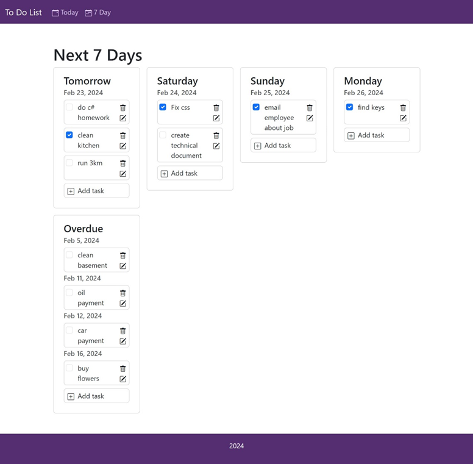
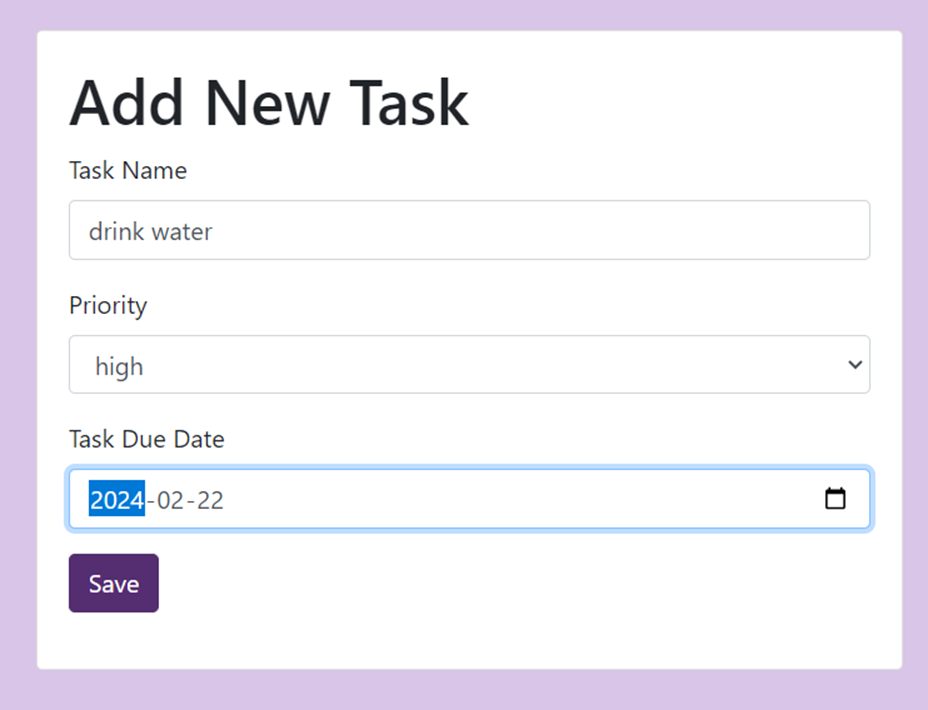

# To Do Web Application

> **Completed for WEBD3201 Assignment 1**
>
> Lauren MacDonald, February 2024
>
> **Languages/Concepts**: Java, JSP, HTML, CSS, Javascript, Bootstrap, Servlet, JDBC, MVC Design, Object-Oriented Programming principles.

## How To Use
### XAMPP
This program is set up to connect with MySQL and can be used with XAMPP to access the database server. To download XAMPP:
https://www.apachefriends.org Follow the installation and set up instructions.

### Tomcat Server
This web app uses Apache Tomcat which can be downloaded from https://tomcat.apache.org/download-90.cgi Follow the
installation and set up instructions.

### Database Server Credentials
username: root
password: none

### Creating the database and applicable tables
Import the SQL document 'to_do_app.sql' into MySQL.

### Access 
Run the program from your IDE to launch the web application.

## Documentation
### Description
This web application allows the user to add, update and delete tasks from their to do list. The tasks are displayed in 
one of two formats (tasks due today, or tasks due in the next 7 days).

### Screenshots

